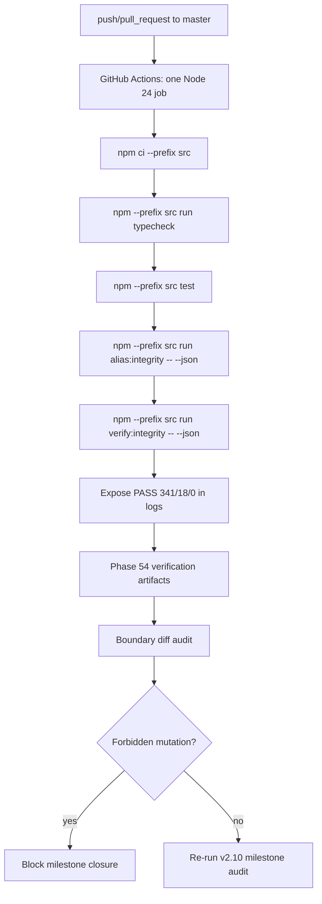

# Phase 54: CI Wiring & Milestone Closure - Research

**Researched:** 2026-06-08  
**Domain:** GitHub Actions CI wiring, npm reproducibility, TypeScript/Vitest validation, alias-integrity proof, milestone boundary audit  
**Confidence:** HIGH for repository-specific facts; MEDIUM for GitHub Actions syntax because external documentation lookup was explicitly out of scope.

<user_constraints>
## User Constraints (from CONTEXT.md)

### Locked Decisions

## Implementation Decisions

### Phase Scope & Execution Order
- **D-01:** Phase 54 delivers only CI Wiring & Milestone Closure for v2.10.
- **D-02:** Satisfy CI-01, CI-02, CI-03, CI-04, BOUND-01, BOUND-02, and BOUND-03 before marking the milestone ready for completion.
- **D-03:** Stabilize `src/tests/analysis/stress.test.ts` as the first task because it is a practical blocker for CI-03 on cold runners.

### Stress Test Stabilization (Task 1)
- **D-04:** Preserve the performance-regression intent of `tests/analysis/stress.test.ts`; do not delete the test or skip it without explicit justification.
- **D-05:** Make the test CI-safe through an explicit, auditable mechanism: either a CI/cold-runner timing threshold or reduced analysis load in CI while still detecting gross regressions.
- **D-06:** Do not change the test's core purpose; only adjust threshold, environment detection, or CI-specific load so `npm --prefix src test` is reliable on GitHub Actions.
- **D-07:** The current ceiling constant `CI_SAFE_ANALYSIS_5K_CEILING_MS = 1500` in `src/tests/analysis/stress.test.ts` is the known flake source on cold runners (389/390 observed in v2.10 milestone audit).

### GitHub Actions Workflow
- **D-08:** Create a GitHub Actions workflow under `.github/workflows/`.
- **D-09:** Use reproducible install via `npm ci --prefix src`.
- **D-10:** CI must run, in order after install: `npm --prefix src run typecheck`, `npm --prefix src test`, `npm --prefix src run alias:integrity -- --json`, and `npm --prefix src run verify:integrity -- --json`.
- **D-11:** Include both `alias:integrity` (CI-04 requirement) and `verify:integrity` (official Phase 53 local guardrail) so CI validates the hardened guardrail surface, not only the base command.
- **D-12:** Keep the workflow simple: one job, no complex matrix, no multi-version Node matrix in this phase.

### Trigger & Runtime Policy
- **D-13:** Trigger on `push` and `pull_request` targeting `master`.
- **D-14:** Use Node.js 24 to align with the current project environment.
- **D-15:** Do not introduce multiple Node versions unless planning uncovers a strong compatibility reason.

### Compile & Guardrail Preservation
- **D-16:** Preserve `scripts.compile` exactly as `node dist/cli/compile.js`.
- **D-17:** Do not add `alias:integrity`, `verify:integrity`, or `compile:quality` to the normal compile path.
- **D-18:** Preserve Phase 53 behavior for `verify:integrity` and `compile:quality` (`/tmp/phase53-compile-quality` quality compile + alias proof).

### Boundary Audit Final
- **D-19:** Run a final milestone boundary audit proving v2.10 made no unauthorized changes to: `data/taxonomy/taxonomy-seed.v2.json`, `data/taxonomy/descriptor_aliases.seed.json`, `data/taxonomy/alias_target_exceptions.v1.json`, `data/compiled/v2/*`, Graphify (`graphify-out/**`), `src/scoring`, `src/ui`, and `src/knowledge-engine`.
- **D-20:** Reuse the Phase 53 boundary-diff pattern as the baseline proof mechanism, adapted for Phase 54 closure.
- **D-21:** `.github/**` is intentionally in scope for Phase 54 CI wiring and must not be treated as forbidden; audit it as an intentional, limited change confined to the new workflow(s).
- **D-22:** Treat preexisting unstaged `graphify-out/**` dirty state like Phase 53: it may remain, must not be staged, and must not be claimed as Phase 54 work.
- **D-23:** Record boundary audit results in Phase 54 verification/summary artifacts.

### Milestone Closure
- **D-24:** Produce Phase 54 GSD artifacts: SUMMARY, VERIFICATION, VALIDATION, and UAT per standard workflow.
- **D-25:** Update `.planning/ROADMAP.md`, `.planning/STATE.md`, and `.planning/REQUIREMENTS.md` only after CI-01 through CI-04 and BOUND-01 through BOUND-03 are proven complete.
- **D-26:** After Phase 54 verification, re-run `/gsd-audit-milestone v2.10`.
- **D-27:** Do not run `/gsd-complete-milestone v2.10` until the milestone audit is clean.

### Optional Traceability
- **D-28:** If cheap and non-blocking, add a light documentary cross-reference linking Phase 52/50 verification closure to Phase 53/54 guardrail and CI work.
- **D-29:** Optional traceability must not compete with or delay CI wiring and boundary proof.

### the agent's Discretion
- The planner may choose the exact stress-test stabilization mechanism (CI env var + adjusted ceiling, reduced synthetic corpus size in CI, warmup pass, etc.) as long as D-04 through D-06 are satisfied and the change is auditable in test output or constants.
- The planner may choose workflow filename, step naming, and whether boundary proof is a shell script, inline CI step, or final-plan verification command, reusing the Phase 53 bash diff gate where practical.
- The planner may skip optional traceability (D-28) if it would expand scope or delay CI delivery.

### Deferred Ideas (OUT OF SCOPE)
- FUT-01 low-support curation and FUT-02 seed/corpus conflict curation remain future milestones.
- Graphify, scoring, UI, MVP, and Knowledge Engine work remain excluded.
- Multi-version Node CI matrix, path-filtered workflows, and advanced CI features (caching layers, deployment, notifications) are deferred unless planning finds a minimal necessity.
- Formal `52-VERIFICATION.md` creation and deep Phase 50/52/53 traceability docs are optional (D-28) and must not block CI delivery.
- `/gsd-complete-milestone v2.10` is explicitly deferred until post-Phase-54 milestone audit is clean.
</user_constraints>

<phase_requirements>
## Phase Requirements

| ID | Description | Research Support |
|----|-------------|------------------|
| CI-01 | Maintainer can run GitHub Actions or equivalent CI that installs `src` package dependencies reproducibly. | Use `npm ci --prefix src` with existing `src/package-lock.json` lockfile. [VERIFIED: src/package-lock.json; .planning/REQUIREMENTS.md] |
| CI-02 | CI verifies `npm --prefix src run typecheck`. | `src/package.json` defines `typecheck` as `tsc --noEmit`; workflow must run it after install. [VERIFIED: src/package.json] |
| CI-03 | CI verifies `npm --prefix src test`. | `src/package.json` defines `test` as `vitest run`; stabilize `src/tests/analysis/stress.test.ts` first because the audit observed 389/390 with timing flake risk. [VERIFIED: src/package.json; .planning/v2.10-MILESTONE-AUDIT.md; src/tests/analysis/stress.test.ts] |
| CI-04 | CI verifies `npm --prefix src run alias:integrity -- --json`. | `alias:integrity` runs `npm run precompile && node dist/cli/alias_integrity.js`; JSON proof asserts PASS `341/18/0`. [VERIFIED: src/package.json; src/tests/cli/alias_integrity.test.ts; src/cli/alias_integrity.ts] |
| BOUND-01 | Reviewer can confirm v2.10 makes no changes to `data/taxonomy/taxonomy-seed.v2.json`. | Reuse Phase 53 boundary diff pattern, with Phase 54-specific `.github/**` allowance. [VERIFIED: 53-03-PLAN.md; 54-CONTEXT.md] |
| BOUND-02 | Reviewer can confirm v2.10 does not publish or mutate `data/compiled/v2/*`. | Boundary audit must include staged and unstaged diffs for `data/compiled/v2`. [VERIFIED: 53-03-PLAN.md; scripts/check-safety-guards.sh] |
| BOUND-03 | Reviewer can confirm v2.10 does not open FUT-01, FUT-02, Graphify, scoring, UI, MVP or Knowledge Engine work. | Audit paths include `graphify-out/**`, `src/scoring`, `src/ui`, `src/knowledge-engine`; document no FUT-01/FUT-02 work. [VERIFIED: 54-CONTEXT.md; .planning/REQUIREMENTS.md] |
</phase_requirements>

## Project Constraints (from AGENTS.md)

No `AGENTS.md` exists at repository root. [VERIFIED: glob AGENTS.md returned no files]

## Summary

Phase 54 is a small infrastructure-and-closure phase: first stabilize the existing Vitest stress benchmark for cold CI runners, then add one GitHub Actions workflow under `.github/workflows/` that runs `npm ci --prefix src`, `typecheck`, `test`, `alias:integrity -- --json`, and `verify:integrity -- --json` in that order. [VERIFIED: 54-CONTEXT.md; src/package.json] The repository currently has no `.github/workflows/*` files, so workflow wiring is greenfield and `.github/**` is intentionally allowed only for this phase. [VERIFIED: glob .github/workflows/*; 54-CONTEXT.md]

The critical planning risk is CI flakiness from `src/tests/analysis/stress.test.ts`, whose current `CI_SAFE_ANALYSIS_5K_CEILING_MS = 1500` ceiling is called out by the milestone audit as a timing risk after an integration run observed `389/390`. [VERIFIED: src/tests/analysis/stress.test.ts; .planning/v2.10-MILESTONE-AUDIT.md] The planner should make this test CI-safe with an explicit auditable mechanism rather than removing or skipping its performance-regression purpose. [VERIFIED: 54-CONTEXT.md]

Closure is not complete when CI is added; Phase 54 must also produce boundary proof that v2.10 did not mutate taxonomy truth, alias policy files, compiled v2 artifacts, Graphify, scoring, UI, MVP, or Knowledge Engine scope. [VERIFIED: 54-CONTEXT.md; .planning/REQUIREMENTS.md] Preexisting unstaged `graphify-out/**` dirt is present now and must remain unstaged and unclaimed. [VERIFIED: git status/diff]

**Primary recommendation:** Plan three tasks: (1) stabilize the stress benchmark, (2) add one simple Node 24 GitHub Actions workflow for the locked npm command sequence, and (3) run/record CI proof plus Phase 54 boundary and milestone-closure artifacts. [VERIFIED: 54-CONTEXT.md]

## Architectural Responsibility Map

| Capability | Primary Tier | Secondary Tier | Rationale |
|------------|-------------|----------------|-----------|
| Reproducible dependency install | CI runner | `src` package | `npm ci --prefix src` consumes `src/package-lock.json` from the repo root. [VERIFIED: 54-CONTEXT.md; src/package-lock.json] |
| TypeScript validation | CI runner | TypeScript compiler in `src` | CI should invoke existing `typecheck` script, which runs `tsc --noEmit`. [VERIFIED: src/package.json] |
| Test validation | CI runner | Vitest tests under `src/tests` | CI should invoke existing `test` script, which runs `vitest run` and includes `tests/**/*.test.ts`. [VERIFIED: src/package.json; src/vitest.config.ts] |
| Alias-integrity proof | CI runner | `src/cli/alias_integrity.ts` and compiled `dist` | `alias:integrity` and `verify:integrity` run `precompile` then `dist/cli/alias_integrity.js`, producing PASS/FAIL and JSON output. [VERIFIED: src/package.json; src/cli/alias_integrity.ts] |
| Milestone boundary audit | Planning/verification artifacts | Git working tree | Boundary proof is a repo-state audit, not application behavior. [VERIFIED: 53-03-PLAN.md; 54-CONTEXT.md] |

## Standard Stack

### Core
| Tool | Version | Purpose | Why Standard |
|------|---------|---------|--------------|
| GitHub Actions workflow YAML | N/A | Execute CI on push/PR to `master`. | Locked by Phase 54 decisions; no workflow exists yet. [VERIFIED: 54-CONTEXT.md; glob .github/workflows/*] |
| Node.js | 24 | Runtime for npm scripts in CI. | Locked by D-14 and local environment is `v24.14.0`. [VERIFIED: 54-CONTEXT.md; node --version] |
| npm | 11.9.0 local | Reproducible install and script runner. | Existing lockfile is npm lockfileVersion 3 and required command is `npm ci --prefix src`. [VERIFIED: src/package-lock.json; npm --version; 54-CONTEXT.md] |
| TypeScript | `^5.8.0` in package, lockfile installed version not fully enumerated in this research | Typecheck/build. | Existing project script uses `tsc`; no package changes authorized. [VERIFIED: src/package.json] |
| Vitest | `^3.2.0` in package, lockfile installed version not fully enumerated in this research | Test runner. | Existing project script uses `vitest run`; no package changes authorized. [VERIFIED: src/package.json] |

### Supporting
| Tool | Version | Purpose | When to Use |
|------|---------|---------|-------------|
| `git diff --name-only` | Git 2.54.0 local | Boundary proof for staged/unstaged protected paths. | Final closure verification and summary evidence. [VERIFIED: git --version; 53-03-PLAN.md] |
| `scripts/check-safety-guards.sh` | N/A | Existing non-mutating guard for staged Graphify and protected paths. | Reference pattern only; Phase 54 requires a broader/custom boundary list including `.github` allowance. [VERIFIED: scripts/check-safety-guards.sh; 54-CONTEXT.md] |

### Alternatives Considered
| Instead of | Could Use | Tradeoff |
|------------|-----------|----------|
| One simple GitHub Actions job | Multi-version Node matrix | Deferred by D-12/D-15 unless a strong compatibility reason appears. [VERIFIED: 54-CONTEXT.md] |
| Direct workflow steps | Dedicated shell script for CI proof | Either is allowed; inline steps are smaller, script is more reusable for local verification. [VERIFIED: 54-CONTEXT.md] |
| CI-safe timing threshold | Reduced synthetic corpus size in CI or warmup pass | All are allowed if auditable and still detect gross regressions. [VERIFIED: 54-CONTEXT.md] |

**Installation:** No new packages should be installed or added. CI should install existing locked dependencies only:

```bash
npm ci --prefix src
```

**Version verification:** External registry verification was intentionally skipped because the user constrained research to internal-only and no package installs. Existing package names and version ranges are taken from `src/package.json` and `src/package-lock.json`. [VERIFIED: user scope; src/package.json; src/package-lock.json]

## Package Legitimacy Audit

No new external packages are recommended for Phase 54. [VERIFIED: 54-CONTEXT.md] The workflow will install existing locked `src` dependencies via `npm ci --prefix src`; package legitimacy/slopcheck was not run because the user explicitly forbade installing packages and external/web research. [VERIFIED: user scope]

| Package | Registry | Age | Downloads | Source Repo | slopcheck | Disposition |
|---------|----------|-----|-----------|-------------|-----------|-------------|
| N/A | N/A | N/A | N/A | N/A | Not run | No new package additions |

**Packages removed due to slopcheck [SLOP] verdict:** none.  
**Packages flagged as suspicious [SUS]:** none.

## Architecture Patterns

### System Architecture Diagram



### Recommended Project Structure

```text
.github/
└── workflows/
    └── ci.yml                 # single Phase 54 workflow; filename may vary

.planning/phases/54-ci-wiring-milestone-closure/
├── 54-RESEARCH.md             # this research
├── 54-01-PLAN.md              # likely stress stabilization
├── 54-02-PLAN.md              # likely CI wiring
├── 54-03-PLAN.md              # likely proof + closure artifacts
├── 54-SUMMARY.md              # closure summary
├── 54-VERIFICATION.md         # command/CI/boundary evidence
├── 54-VALIDATION.md           # Nyquist validation evidence
└── 54-UAT.md                  # acceptance evidence
```

### Pattern 1: Minimal CI workflow consumer
**What:** A single workflow job that checks out code, sets Node 24, installs `src` dependencies with `npm ci --prefix src`, then runs the locked command sequence. [VERIFIED: 54-CONTEXT.md]  
**When to use:** Use in Phase 54; do not add matrix/caching/deployments unless necessary. [VERIFIED: 54-CONTEXT.md]

**Example:**
```yaml
# Source: repository decisions, not external docs. [VERIFIED: 54-CONTEXT.md]
name: CI

on:
  push:
    branches: [master]
  pull_request:
    branches: [master]

jobs:
  src:
    runs-on: ubuntu-latest
    steps:
      - uses: actions/checkout@v4
      - uses: actions/setup-node@v4
        with:
          node-version: '24'
      - run: npm ci --prefix src
      - run: npm --prefix src run typecheck
      - run: npm --prefix src test
      - run: npm --prefix src run alias:integrity -- --json
      - run: npm --prefix src run verify:integrity -- --json
```

`actions/checkout@v4` and `actions/setup-node@v4` are common GitHub Actions names but were not externally verified in this session due to internal-only scope; planner should treat the exact action versions as [ASSUMED] if strict provenance is required. [ASSUMED]

### Pattern 2: Auditable CI-safe stress threshold
**What:** Keep the stress benchmark but make CI behavior explicit through constants/log output. [VERIFIED: 54-CONTEXT.md; src/tests/analysis/stress.test.ts]  
**When to use:** First task, before relying on `npm --prefix src test` in CI. [VERIFIED: 54-CONTEXT.md]

**Example:**
```typescript
// Source: derived from existing test structure. [VERIFIED: src/tests/analysis/stress.test.ts]
const ANALYSIS_5K_MATERIALS = 5000
const LOCAL_ANALYSIS_5K_CEILING_MS = 1500
const CI_ANALYSIS_5K_CEILING_MS = 3000
const ANALYSIS_5K_CEILING_MS = process.env['CI'] === 'true'
  ? CI_ANALYSIS_5K_CEILING_MS
  : LOCAL_ANALYSIS_5K_CEILING_MS

// Keep log including materials + ceiling so CI output explains the active threshold.
```

### Pattern 3: Phase 54 boundary proof adapted from Phase 53
**What:** Check `graphify-out/**` staged-only, and check all protected/deferred scopes staged and unstaged; allow `.github/workflows/**` as intentional Phase 54 work. [VERIFIED: 53-03-PLAN.md; 54-CONTEXT.md]

**Example:**
```bash
# Source: adapted from Phase 53 boundary proof. [VERIFIED: 53-03-PLAN.md; 54-CONTEXT.md]
set -e
graphify_staged=$(git diff --cached --name-only -- graphify-out 2>/dev/null)
if [ -n "$graphify_staged" ]; then
  printf "staged graphify-out forbidden changes:\n%s\n" "$graphify_staged"
  exit 1
fi

for mode in unstaged staged; do
  if [ "$mode" = staged ]; then
    files=$(git diff --cached --name-only -- \
      data/taxonomy/taxonomy-seed.v2.json \
      data/taxonomy/descriptor_aliases.seed.json \
      data/taxonomy/alias_target_exceptions.v1.json \
      data/compiled/v2 src/scoring src/ui src/knowledge-engine 2>/dev/null)
  else
    files=$(git diff --name-only -- \
      data/taxonomy/taxonomy-seed.v2.json \
      data/taxonomy/descriptor_aliases.seed.json \
      data/taxonomy/alias_target_exceptions.v1.json \
      data/compiled/v2 src/scoring src/ui src/knowledge-engine 2>/dev/null)
  fi
  if [ -n "$files" ]; then
    printf "%s forbidden changes:\n%s\n" "$mode" "$files"
    exit 1
  fi
done
```

### Anti-Patterns to Avoid
- **Skipping or deleting the stress test:** Violates D-04 and weakens performance regression coverage. [VERIFIED: 54-CONTEXT.md]
- **Adding `alias:integrity` to `compile`:** Violates compile isolation from D-16/D-17 and Phase 53 proof. [VERIFIED: 54-CONTEXT.md; 53-VERIFICATION.md]
- **Publishing regenerated compiled artifacts for proof:** Violates BOUND-02; use existing CLI proof and temp outputs only. [VERIFIED: .planning/REQUIREMENTS.md; 53-03-SUMMARY.md]
- **Treating `.github/**` as forbidden in Phase 54:** Phase 54 explicitly allows limited CI workflow changes. [VERIFIED: 54-CONTEXT.md]
- **Staging graphify-out dirt:** Existing dirty graphify-out files are unclaimed preexisting state and must not be staged. [VERIFIED: git status/diff; 54-CONTEXT.md]

## Don't Hand-Roll

| Problem | Don't Build | Use Instead | Why |
|---------|-------------|-------------|-----|
| CI runner orchestration | Custom shell runner or bespoke CI harness | GitHub Actions workflow | Phase explicitly calls for GitHub Actions or equivalent and locks `.github/workflows/`. [VERIFIED: 54-CONTEXT.md] |
| Dependency reproducibility | `npm install` | `npm ci --prefix src` | Locked decision D-09; lockfile exists. [VERIFIED: 54-CONTEXT.md; src/package-lock.json] |
| Type/test/alias checks | New wrapper CLI | Existing npm scripts | Scripts already exist and are Phase 53-proven. [VERIFIED: src/package.json; 53-VERIFICATION.md] |
| Alias integrity validation | New validator | `alias:integrity` / `verify:integrity` | Existing CLI emits JSON PASS/FAIL and tests assert `341/18/0`. [VERIFIED: src/cli/alias_integrity.ts; src/tests/cli/alias_integrity.test.ts] |
| Boundary audit | Manual visual inspection only | Phase 53-style `git diff` proof plus written artifacts | Existing pattern gives executable proof. [VERIFIED: 53-03-PLAN.md] |

**Key insight:** Phase 54 should consume existing scripts and artifacts; creating new validation logic increases risk and scope without satisfying new requirements. [VERIFIED: src/package.json; 54-CONTEXT.md]

## Common Pitfalls

### Pitfall 1: CI test flake from cold-runner timing
**What goes wrong:** `npm --prefix src test` fails because `analysis(5k)` exceeds the 1500ms ceiling. [VERIFIED: src/tests/analysis/stress.test.ts; .planning/v2.10-MILESTONE-AUDIT.md]  
**Why it happens:** The test encodes a hard elapsed-time assertion that may be too tight on cold CI runners. [VERIFIED: src/tests/analysis/stress.test.ts; .planning/v2.10-MILESTONE-AUDIT.md]  
**How to avoid:** Make CI behavior explicit and logged with a higher CI threshold, reduced CI load, or warmup pass while preserving gross regression detection. [VERIFIED: 54-CONTEXT.md]  
**Warning signs:** Full suite observed as `389/390` or log shows elapsed time above `1500ms`. [VERIFIED: .planning/v2.10-MILESTONE-AUDIT.md]

### Pitfall 2: `alias:integrity -- --json` rebuild cost surprises
**What goes wrong:** Both `alias:integrity` and `verify:integrity` run `precompile`; CI will build twice unless commands are changed. [VERIFIED: src/package.json]  
**Why it happens:** Existing scripts intentionally include `npm run precompile`. [VERIFIED: src/package.json]  
**How to avoid:** Prefer preserving scripts exactly for Phase 53 behavior; only optimize if planner accepts risk and still satisfies D-18. [VERIFIED: 54-CONTEXT.md]  
**Warning signs:** CI latency is higher than expected, but this is not a correctness blocker. [ASSUMED]

### Pitfall 3: Boundary audit accidentally forbids intended CI workflow
**What goes wrong:** Reusing Phase 53 boundary proof unchanged blocks `.github/**`. [VERIFIED: 53-03-PLAN.md; 54-CONTEXT.md]  
**Why it happens:** Phase 53 explicitly forbade `.github`; Phase 54 explicitly allows limited `.github/workflows/**` changes. [VERIFIED: 53-03-PLAN.md; 54-CONTEXT.md]  
**How to avoid:** Adapt the forbidden-path list for Phase 54 and separately confirm `.github` changes are limited to workflow file(s). [VERIFIED: 54-CONTEXT.md]  
**Warning signs:** Boundary script reports `.github` as forbidden despite Phase 54 scope. [VERIFIED: 54-CONTEXT.md]

### Pitfall 4: Milestone docs updated too early
**What goes wrong:** ROADMAP/STATE/REQUIREMENTS claim Phase 54 complete before CI and boundary proof pass. [VERIFIED: 54-CONTEXT.md]  
**Why it happens:** Milestone closure artifacts are tempting to update before proof is collected. [ASSUMED]  
**How to avoid:** Update planning status files only after CI-01..CI-04 and BOUND-01..BOUND-03 are proven. [VERIFIED: 54-CONTEXT.md]

## Code Examples

### Existing command contracts
```bash
# Source: src/package.json and Phase 54 decisions. [VERIFIED: src/package.json; 54-CONTEXT.md]
npm ci --prefix src
npm --prefix src run typecheck
npm --prefix src test
npm --prefix src run alias:integrity -- --json
npm --prefix src run verify:integrity -- --json
```

### Static compile isolation proof
```bash
# Source: Phase 53 proof pattern. [VERIFIED: 53-03-PLAN.md]
node -e "const fs=require('fs'); const pkg=JSON.parse(fs.readFileSync('src/package.json','utf8')); const compile=pkg.scripts.compile; if (compile !== 'node dist/cli/compile.js') { throw new Error('compile script changed: '+compile) } if (/alias:integrity|verify:integrity|compile:quality/.test(compile)) { throw new Error('compile script contains forbidden integrity/quality token') }"
```

### Alias JSON proof fields
```json
{
  "status": "PASS",
  "seed_alias_count": 18,
  "compiled_descriptor_count": 341,
  "valid_target_count": 18,
  "unresolved_target_count": 0,
  "unresolved": []
}
```
Source: `src/tests/cli/alias_integrity.test.ts` and `src/tests/inventory/alias_target_inventory.test.ts`. [VERIFIED: src/tests/cli/alias_integrity.test.ts; src/tests/inventory/alias_target_inventory.test.ts]

## State of the Art

| Old Approach | Current Approach | When Changed | Impact |
|--------------|------------------|--------------|--------|
| Local-only alias proof with no CI consumer | CI should consume `alias:integrity -- --json` and `verify:integrity -- --json` | Phase 54 target | Protects `341/18/0` baseline in automated flow. [VERIFIED: ROADMAP.md; 54-CONTEXT.md] |
| Phase 53 forbids `.github` changes | Phase 54 allows limited `.github/workflows/**` changes | Phase 54 | Boundary audit must be adapted. [VERIFIED: 53-03-PLAN.md; 54-CONTEXT.md] |
| `compile` might be a tempting guardrail target | `compile` remains exactly `node dist/cli/compile.js`; guardrails live in quality/CI flows | Phase 53 | Everyday compile remains lightweight. [VERIFIED: src/package.json; 53-VERIFICATION.md] |

**Deprecated/outdated:**
- Treating Phase 53 boundary commands as copy/paste exact for Phase 54 is outdated because `.github` is now in scope. [VERIFIED: 53-03-PLAN.md; 54-CONTEXT.md]

## Assumptions Log

| # | Claim | Section | Risk if Wrong |
|---|-------|---------|---------------|
| A1 | `actions/checkout@v4` and `actions/setup-node@v4` are the exact current action versions to use. | Architecture Patterns / CI workflow example | Workflow could reference stale action versions; planner can verify if external docs are allowed during implementation. |
| A2 | Duplicate `precompile` work in `alias:integrity` and `verify:integrity` is only a latency concern, not a correctness blocker. | Common Pitfalls | CI runtime may be longer than desired; keep scripts unchanged unless optimization is explicitly planned. |
| A3 | Early milestone-doc updates are tempting before proof. | Common Pitfalls | Process risk only; locked D-25 already prevents this. |

## Open Questions (RESOLVED)

1. **Should stress stabilization use higher CI ceiling, smaller CI corpus, or warmup?**
   - RESOLVED: use a CI-specific threshold constant first, not a smaller CI corpus or warmup pass, because it minimally changes test shape, preserves the 5k benchmark semantics, and keeps the active mode/ceiling auditable in test output. [VERIFIED: 54-CONTEXT.md D-04/D-05/D-06; 54-PATTERNS.md stress-test pattern]
   - Follow-up if execution evidence fails: executor may still adjust within D-04 through D-06, but must preserve 5000 materials, positive assertions, and explicit auditable mode/ceiling behavior. [VERIFIED: 54-CONTEXT.md]
2. **Should workflow include npm cache?**
   - RESOLVED: omit npm cache in Phase 54. Caching is an advanced CI feature deferred by the user unless minimally necessary, and no evidence currently makes it necessary. [VERIFIED: 54-CONTEXT.md D-12/D-15 and deferred ideas]

## Environment Availability

| Dependency | Required By | Available | Version | Fallback |
|------------|-------------|-----------|---------|----------|
| Node.js | Local proof / CI parity | ✓ | v24.14.0 | GitHub Actions Node 24 setup. [VERIFIED: node --version; 54-CONTEXT.md] |
| npm | `npm ci --prefix src` and scripts | ✓ | 11.9.0 | None needed. [VERIFIED: npm --version] |
| git | Boundary audit | ✓ | 2.54.0 | None needed. [VERIFIED: git --version] |
| `.github/workflows/` | CI-01..CI-04 | ✗ | No files | Add workflow in Phase 54. [VERIFIED: glob .github/workflows/*] |

**Missing dependencies with no fallback:**
- GitHub Actions workflow file is missing; creating it is the main CI-01 deliverable. [VERIFIED: glob .github/workflows/*; .planning/REQUIREMENTS.md]

**Missing dependencies with fallback:**
- None identified. [VERIFIED: environment probes]

## Validation Architecture

### Test Framework
| Property | Value |
|----------|-------|
| Framework | Vitest `^3.2.0` in package.json. [VERIFIED: src/package.json] |
| Config file | `src/vitest.config.ts` includes `tests/**/*.test.ts`. [VERIFIED: src/vitest.config.ts] |
| Quick run command | `npm --prefix src test -- tests/analysis/stress.test.ts` for stress stabilization; `npm --prefix src run typecheck` for compile-safety. [VERIFIED: src/package.json; src/tests/analysis/stress.test.ts] |
| Full suite command | `npm --prefix src test`. [VERIFIED: src/package.json; 54-CONTEXT.md] |

### Phase Requirements → Test Map
| Req ID | Behavior | Test Type | Automated Command | File Exists? |
|--------|----------|-----------|-------------------|-------------|
| CI-01 | Reproducible install from lockfile under `src`. | CI smoke | `npm ci --prefix src` | ✅ `src/package-lock.json` |
| CI-02 | TypeScript typecheck passes in CI. | CI/typecheck | `npm --prefix src run typecheck` | ✅ `src/package.json`, `src/tsconfig.json` |
| CI-03 | Full test suite passes in CI. | CI/test | `npm --prefix src test` | ✅ `src/tests/**/*.test.ts` |
| CI-04 | Alias integrity JSON proof exposes PASS `341/18/0`. | CI/CLI proof | `npm --prefix src run alias:integrity -- --json` | ✅ `src/cli/alias_integrity.ts` |
| BOUND-01 | Taxonomy seed untouched. | Boundary audit | `git diff --name-only -- data/taxonomy/taxonomy-seed.v2.json` plus staged equivalent | ✅ path exists by tests/reference |
| BOUND-02 | Compiled v2 artifacts untouched. | Boundary audit | `git diff --name-only -- data/compiled/v2` plus staged equivalent | ✅ path referenced by tests |
| BOUND-03 | Deferred scopes untouched and Graphify unclaimed. | Boundary audit | Phase 54 adapted boundary script | ✅ pattern exists in `53-03-PLAN.md` |

### Sampling Rate
- **Per task commit:** Run focused command for touched area plus `npm --prefix src run typecheck`. [VERIFIED: src/package.json]
- **Per wave merge:** Run `npm --prefix src test` and alias JSON proof. [VERIFIED: 54-CONTEXT.md]
- **Phase gate:** Full locked CI command sequence plus boundary audit before `/gsd-verify-work`. [VERIFIED: 54-CONTEXT.md]

### Wave 0 Gaps
- [ ] `.github/workflows/<ci-name>.yml` — covers CI-01..CI-04. [VERIFIED: glob .github/workflows/*]
- [ ] `src/tests/analysis/stress.test.ts` stabilization — covers CI-03 reliability. [VERIFIED: .planning/v2.10-MILESTONE-AUDIT.md]
- [ ] Phase 54 closure artifacts (`54-SUMMARY.md`, `54-VERIFICATION.md`, `54-VALIDATION.md`, `54-UAT.md`) — covers milestone closure. [VERIFIED: 54-CONTEXT.md]

## Security Domain

### Applicable ASVS Categories

| ASVS Category | Applies | Standard Control |
|---------------|---------|-----------------|
| V2 Authentication | no | No auth changes in phase. [VERIFIED: 54-CONTEXT.md] |
| V3 Session Management | no | No session changes in phase. [VERIFIED: 54-CONTEXT.md] |
| V4 Access Control | no | No runtime access-control changes in phase. [VERIFIED: 54-CONTEXT.md] |
| V5 Input Validation | yes | Preserve existing TypeScript/Vitest/alias-integrity validation; do not add new parser surface. [VERIFIED: src/package.json; src/cli/alias_integrity.ts] |
| V6 Cryptography | no | No cryptography changes in phase. [VERIFIED: 54-CONTEXT.md] |

### Known Threat Patterns for CI Wiring

| Pattern | STRIDE | Standard Mitigation |
|---------|--------|---------------------|
| Non-reproducible dependency install | Tampering | Use `npm ci --prefix src` against `src/package-lock.json`. [VERIFIED: 54-CONTEXT.md; src/package-lock.json] |
| CI misses local guardrail behavior | Repudiation | Run both `alias:integrity -- --json` and `verify:integrity -- --json`. [VERIFIED: 54-CONTEXT.md] |
| Workflow scope creep into build/publish/deploy | Tampering | Single job, no publish/deploy/artifact mutation steps. [VERIFIED: 54-CONTEXT.md] |
| Protected taxonomy/compiled/deferred files accidentally staged | Tampering | Run adapted boundary diff audit before closure. [VERIFIED: 53-03-PLAN.md; 54-CONTEXT.md] |

## Sources

### Primary (HIGH confidence)
- `.planning/phases/54-ci-wiring-milestone-closure/54-CONTEXT.md` — locked decisions, scope, command order, boundaries. [VERIFIED: file read]
- `.planning/REQUIREMENTS.md` — CI-01..CI-04 and BOUND-01..BOUND-03 definitions. [VERIFIED: file read]
- `.planning/ROADMAP.md` — Phase 54 goal, success criteria, dependency on Phase 53. [VERIFIED: file read]
- `.planning/STATE.md` — current milestone position. [VERIFIED: file read]
- `.planning/v2.10-MILESTONE-AUDIT.md` — open gaps and stress flake evidence. [VERIFIED: file read]
- `src/package.json`, `src/package-lock.json`, `src/vitest.config.ts` — scripts, lockfile, test config. [VERIFIED: file read]
- `src/tests/analysis/stress.test.ts` — CI flake source and benchmark structure. [VERIFIED: file read]
- Phase 53 artifacts (`53-03-PLAN.md`, `53-03-SUMMARY.md`, `53-VERIFICATION.md`) — proof/boundary patterns and 341/18/0 baseline. [VERIFIED: file read]

### Secondary (MEDIUM confidence)
- Local environment probes: Node v24.14.0, npm 11.9.0, git 2.54.0, dirty graphify-out state. [VERIFIED: bash probes]

### Tertiary (LOW confidence)
- Common GitHub Actions action version names `actions/checkout@v4` and `actions/setup-node@v4`; not externally verified due to strict internal-only scope. [ASSUMED]

## Metadata

**Confidence breakdown:**
- Standard stack: HIGH for existing npm/TypeScript/Vitest scripts; MEDIUM for exact GitHub action versions because no external docs were allowed.
- Architecture: HIGH — driven by locked decisions and existing repository scripts.
- Pitfalls: HIGH for stress flake and boundary-scope risks; MEDIUM for CI latency concerns.

**Research date:** 2026-06-08  
**Valid until:** 2026-07-08 for repository facts; 2026-06-15 for GitHub Actions action-version assumptions if external verification becomes allowed.
